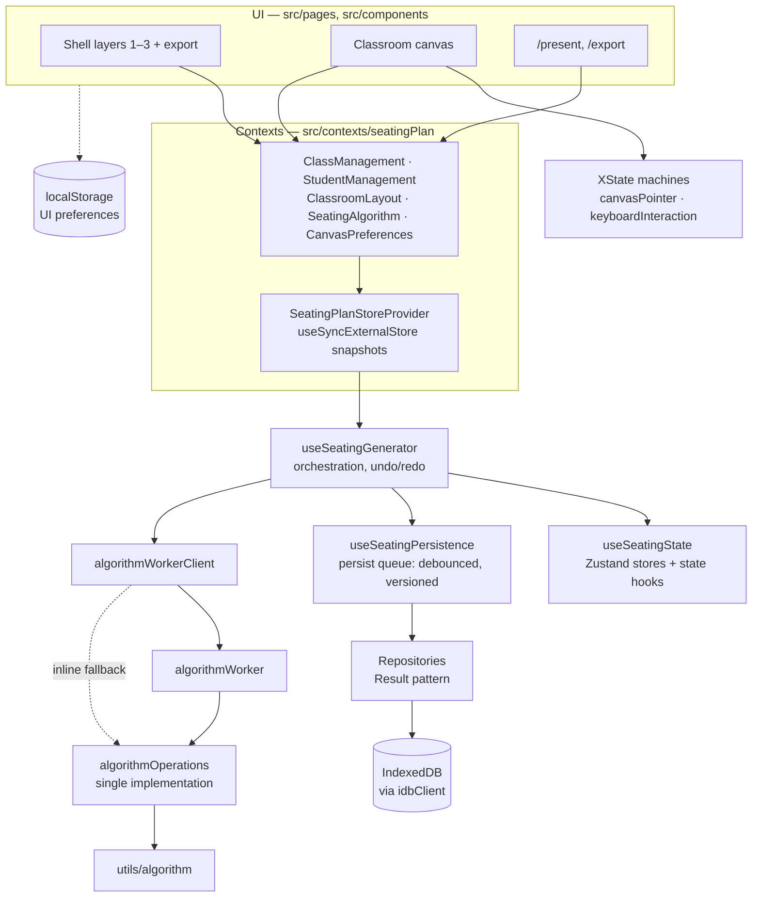
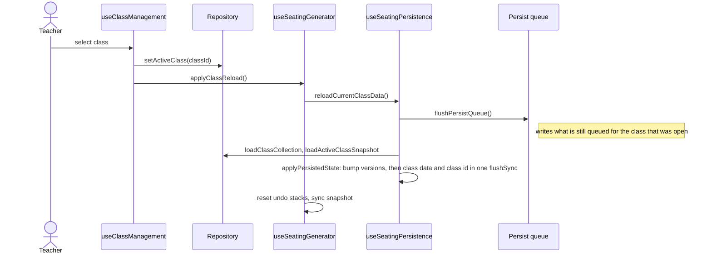

# Architecture

> **Status:** current · **Last reviewed:** 2026-09-20 · **Maintainer:** Eike
> Schäfer · **Describes:** Klassenplan 2.2.0

This is the entry point for anyone who wants to understand _why_ Klassenplan is
built the way it is. The documents linked at the end explain the individual
parts in depth; this one explains what they are for and how they fit together.

## Objective

Klassenplan helps teachers build, adjust and present seating plans from a class
list they already have — entirely in the browser, without an account, and
without student data ever leaving the device.

## Background

Teachers rebuild seating plans several times a year. Research puts the effect
of a seating arrangement on learning at a small d ≈ 0.1–0.2
([PEDAGOGY.md](PEDAGOGY.md)), so the value of a tool is not a mathematically
optimal plan. It lies in taking the preparation load off the teacher and in
structuring the reflection about how a class is composed. The algorithm's result
is a suggestion, never a decision.

The inputs are sensitive: names, optional photos and short descriptions of
current behaviour, mostly of minors. Depending on the reason behind it, a flag
such as `needsFrontSeat` can even touch Art. 9 GDPR. Klassenplan therefore runs
completely in the browser. The server only delivers static files; there is no
account, no server-side storage and no telemetry
([decision 0001](decisions/0001-offline-first-no-server.md)). Most of the
architecture follows from that one decision: the algorithm runs in a web worker,
data lives in IndexedDB, the app works offline as a PWA, moving between devices
happens through an encrypted backup file, and search engines get prerendered
HTML instead of a server-rendered page.

Klassenplan has been released since v1.0.0 (August 2025), works offline since
v1.2.0 and has been open source since v1.6.0 (June 2026);
[CHANGELOG.md](CHANGELOG.md) shows how it grew.

## Goals

1. **A usable plan in a few steps from the list the school already has.** Class
   lists exported from WebUntis, Schulmanager Online or SchILD-NRW import as
   they are; nobody has to retype a class.
2. **Student data stays on the teacher's device.** Nothing is transmitted,
   nothing is stored on a server.
3. **Teachers do not lose their work.** Changes are saved automatically, an
   encrypted backup moves everything to another device, and a reminder appears
   when the last backup is more than 30 days old.
4. **It works where lessons happen:** on the projector or whiteboard for a
   whole school day, on a tablet, on a laptop — and offline once loaded.
5. **The teacher stays in charge.** Seats can be locked and moved by hand, the
   weights are adjustable, statistics show which criteria a plan meets, and the
   pedagogical assumptions behind the defaults are written down.
6. **Everyone can use it:** keyboard only, with a screen reader, at 200 % zoom,
   in German or English.
7. **A school can run its own copy** from the published Docker image.

## Non-goals

- **No accounts, no sync, no sharing.** The only way data leaves a browser is
  a backup file the teacher exports.
- **No server-side storage, analytics, telemetry or remote logging.**
- **No classes above 36 students.**
- **No diagnoses.** Student attributes describe current behaviour in context;
  `needsFrontSeat` deliberately stores no reason.
- **No claim to the optimal plan** and no replacement for pedagogical judgement.
- **No free-form room geometry.** The room is a fixed 900 × 600 scene.
- **Phones are secondary.** The layout works there, but desktop, projector and
  tablet come first.
- **No English legal pages.** Impressum and Datenschutz are German only, as
  German law requires.

## Scenarios

**1. A new class at the start of the school year.** A teacher exports the class
list from WebUntis and drops the CSV into step 1. The import runs in its own
worker, detects the encoding and the WebUntis columns, and names the format it
found. In step 2 the teacher places tables from the toolbar and marks window,
door and board. In step 3 they set a few weights and press _Mischen_: the
arrangement is constructed and then refined in the algorithm worker, so the UI
stays responsive. They swap two students by hand, lock one seat and save the
plan under a name — which the plan usage record notes as a plan that is really
in use.

**2. On the projector for a whole school day.** The teacher opens `/present` on
the classroom PC in the morning and leaves the tab open. After 30 seconds the
plan counts as presented. If a new version is deployed during the day, the open
tab notices within the hour and _offers_ a reload; it never reloads on its own
in the middle of a lesson.

**3. A new term, new neighbours.** Months later the teacher shuffles again. The
"avoid previous pairs" criterion reads the plans that were really used —
presented, exported, saved — instead of the dozens of experiments from the
afternoon the first plan was made. A plan that was counted by mistake can be
withdrawn in the neighbourhood tab.

**4. Moving to another device.** The teacher exports an encrypted backup with a
password of at least eight characters, copies the file to the school laptop and
imports it there. The password is never stored; without it the file is
unreadable.

**5. A school hosts its own instance.** An IT administrator runs
`docker compose up -d` with `SITE_URL` set to the school's domain and puts a
TLS-terminating reverse proxy in front. The image already carries the security
headers.

**6. A shared computer in the staff room.** Data is stored unencrypted in the
browser profile, so anyone using the same profile can read it. This is a known
trade-off of having no server and no account ([SECURITY.md](SECURITY.md)); the
mitigation today is organisational — one browser profile per person.

**7. Trying it out before committing a class list.** A teacher hears about
Klassenplan from a colleague, opens the generator and chooses _Beispielklasse
laden_ in the empty class list. Klassenplan creates an ordinary class with 24
invented students, drawn pictures and a furnished room. A short tour points out
the class switcher, the add menu, the attributes and the backup behind the
settings gear in the footer; the room and the seating plan get a tour of their
own when they first open, including the sidebar, the statistics and the seating
circle. Convinced, the teacher imports the real list into a new class and
deletes the sample class
([decision 0015](decisions/0015-onboarding-sample-class-and-tour.md)).

## Constraints

| Constraint                | Value                                     | Why                                                                                                                                                                                |
| ------------------------- | ----------------------------------------- | ---------------------------------------------------------------------------------------------------------------------------------------------------------------------------------- |
| No server                 | static files only                         | Follows from goal 2. Consequences: no telemetry, prerendering for SEO, canonical URLs from the build-time `SITE_URL`, backups as files                                             |
| Students per class        | 36 (`MAX_STUDENTS`)                       | Documented both as algorithm cost ([AGENTS.md](../AGENTS.md)) and as a cap on imported data ([SECURITY.md](SECURITY.md)); the original reason is not recorded — see open questions |
| Room                      | 900 × 600 scene                           | Sized for up to 36 students (`constants.ts`); editor, export and presentation share one coordinate system                                                                          |
| Mix history               | 20 entries (`MIX_HISTORY_LIMIT`)          | Bounds memory and storage; also the window of recent shuffles the repetition criterion looks at                                                                                    |
| Backup files              | 16 MB encrypted, 12 MB decrypted          | Rejects corrupted or malicious files before parsing ([backup-format.md](backup-format.md))                                                                                         |
| Student photos            | 20 MB input, stored as ~160 px JPEG       | Keeps IndexedDB small and strips EXIF/GPS by re-encoding                                                                                                                           |
| Content Security Policy   | `script-src 'self'`, `connect-src 'self'` | No inline scripts, no third-party requests; speculation rules come as an HTTP header                                                                                               |
| Algorithm request timeout | 120 s by default                          | A stuck worker must fail visibly instead of silently re-running on the main thread                                                                                                 |

## How the parts fit together

### Layers

- **UI** components read trimmed state and actions from the domain contexts, not
  from the generator directly. `/present` and `/export` sit inside the same
  provider tree, so they show exactly what the workspace shows.
- **`useSeatingGenerator`** composes state, persistence, algorithm calls, class
  management and the plan usage record into one snapshot. The contexts slice
  that snapshot so a component only re-renders for what it uses.
- **Canvas interaction** (pointer and keyboard) is modelled as XState machines;
  domain data stays in the stores. See
  [canvas-interactions.md](canvas-interactions.md).
- **Persistence** is decoupled from rendering: state changes are queued per key
  (students, saved plans, mix history, current seating, locks, weights, room,
  circle layout, active plan), debounced and written through the repositories.
  Every repository call returns a `Result` ([ERROR-HANDLING.md](ERROR-HANDLING.md)).
- **The algorithm** runs in a web worker. `algorithmOperations.ts` is the only
  implementation, used by the worker and by the inline fallback alike, so both
  paths share their defaults. The fallback runs when workers are unavailable or
  a request fails; an aborted or timed-out request is rejected instead.

### Shuffling a plan

With every weight at 0 the handler uses neutral settings and skips the
refinement — the result is a purely random plan. After a refinement the mix
history holds the refined arrangement
([decision 0014](decisions/0014-mix-history-records-refined-plan.md)). Details
in [ALGORITHM.md](ALGORITHM.md).

### Setting the criteria, and reading the result

The weights are the algorithm's; the words around them are the panel's
([decision 0018](decisions/0018-criteria-in-words-with-recipes.md)):

- **`utils/mixImportance.ts`** maps each weight to one of four named levels and
  back, so a criterion is set as "Wichtig" rather than as 5. A weight inside the
  band survives being set to its own level; "Feinjustierung" brings the slider
  back.
- **`utils/mixRecipes.ts`** holds five named mixes that set all sixteen weights
  at once. Which one is active is derived from the weights, never stored.
- **`utils/algorithm/planReasons.ts`** turns the last mix into up to three
  sentences ("Warum dieser Plan"), built from the per-seat data of
  `criterionHighlights` — the same source the markings on the seats come from.

### Switching classes

The class id never changes ahead of the class data. `useClassManagement` only
records the choice in the repository and reloads; `applyPersistedState` then
sets the class's data and its id inside one `flushSync`, so both arrive in a
single render. A transition is not enough: students, plans and room live in
Zustand stores, which render at once even inside it, while seating and class id
are React state and would wait — the seating sync then looped and froze the
tab. Edits still
queued for the class that was open are written before the load, while the queue
still points at that class. Two guards remain as a backstop: loading bumps the
persist versions, so a job from before the load is discarded, and the restore
gate keeps the freshly loaded data from being queued again. Work that needs the
class id and its data together — such as the plan usage backfill — runs inside
`applyPersistedState`.

### Where data lives

| Data                                                                                              | Where                                                 | Notes                                                                          |
| ------------------------------------------------------------------------------------------------- | ----------------------------------------------------- | ------------------------------------------------------------------------------ |
| Classes: students, saved plans, mix history, current seating, locks, weights, room, circle layout | IndexedDB `spg.classCollection`, one record per class | Older single-class keys are migrated on first load                             |
| Room templates                                                                                    | IndexedDB `spg.classroomTemplates`                    |                                                                                |
| Plan usage record                                                                                 | IndexedDB `spg.planUsage`, one bucket per class       | Pair keys and timestamps only ([ALGORITHM.md](ALGORITHM.md#plan-usage-record)) |
| Student photos                                                                                    | Separate IndexedDB database `spg-student-photos`      | Blobs keyed by student id                                                      |
| Name game statistics                                                                              | IndexedDB `spg.nameGameStats`                         |                                                                                |
| UI preferences                                                                                    | localStorage                                          | No personal data                                                               |
| Backups                                                                                           | A file wherever the teacher saves it                  | AES-GCM encrypted ([backup-format.md](backup-format.md))                       |

All IndexedDB access goes through `src/repositories/idbClient.ts`. Live data is
not encrypted ([SECURITY.md](SECURITY.md)). Record shapes, versions, retention
and what "delete all data" removes are described in
[data-model.md](data-model.md).

### Large modules

A handful of files have grown past a thousand lines. What each one owns is
listed here, so a change knows where to look and what else it touches. Pure
logic moves out once it can be tested on its own; React state and wiring stay
where they are, because splitting a hook with shared refs and closures changes
behaviour more easily than it looks.

| File (lines on 2026-09-14)                                       | Owns                                                                                                       | Moved out                                                                                         | Candidates, not done                                                                                                                        |
| ---------------------------------------------------------------- | ---------------------------------------------------------------------------------------------------------- | ------------------------------------------------------------------------------------------------- | ------------------------------------------------------------------------------------------------------------------------------------------- |
| `src/pages/Export.tsx` (1,317)                                   | Export page: settings seeded from the editor, the preview document, print, PDF, PNG and SVG                | —                                                                                                 | The four output handlers into one hook; they share preview state, so it needs tests first                                                   |
| `src/hooks/canvas/useFeaturePaletteDrag.ts` (1,238)              | Room elements on the canvas: palette drag and drop, dragging, rotating, group drag with tables, long press | Placement math → `src/utils/canvas/featurePlacement.ts`                                           | Splitting the interaction paths needs the shared drag model missing from [canvas-interactions.md](canvas-interactions.md#known-pain-points) |
| `src/hooks/useSeatingPersistence.ts` (1,005)                     | Loading and applying a class, saved plans, backups, "delete all data", room templates                      | CSV export → `src/utils/csv/csvExport.ts`                                                         | Backup and template operations as hooks of their own                                                                                        |
| `src/components/SeatingPlanGenerator/LayoutEditorView.tsx` (986) | Step 2: state and wiring of canvas, palette, context menus, shortcuts and quick setup                      | Canvas column rendering → `src/components/SeatingPlanGenerator/views/LayoutEditorMainSection.tsx` | —                                                                                                                                           |

`src/utils/data/csvUtils.ts`, `SeatingPlanEditorView.tsx`,
`src/utils/validation/backupValidation.ts` and
`src/utils/algorithm/seatingStatistics.ts` are of similar size and not
described yet.

### Build and delivery

- `npm run build:static` builds with Vite, renders every route in both
  languages in Chromium, verifies the output and checks the bundle budgets
  ([SEO.md](SEO.md), [PERFORMANCE.md](PERFORMANCE.md)).
- The Docker image builds on `node:24-bookworm-slim` and serves the result with
  nginx on `debian:trixie-slim`. Security headers come from
  `nginx-security-headers.conf`.
- A push to `main` runs CI only. A `v*` tag publishes the multi-arch image to
  GHCR and creates the GitHub release.
- The service worker precaches the app, so it works offline after the first
  visit. It uses the prompt update model: a new version waits until the teacher
  confirms the reload.

## Quality budgets

Without a server there are no service level objectives to promise. These
budgets take their place; measurements and details are in
[PERFORMANCE.md](PERFORMANCE.md#budgets).

| Quality                         | Budget                                                        | Status                                                                |
| ------------------------------- | ------------------------------------------------------------- | --------------------------------------------------------------------- |
| Load size                       | Initial payload ≤ 250 KB brotli                               | 221 KB; enforced in CI and the Docker build                           |
| Response to _Mischen_           | ≤ 500 ms for 36 students on the slowest supported device      | About 63 ms on an Apple M1 Pro; measured by hand with `npm run bench` |
| Page experience                 | Core Web Vitals "good"                                        | Logged in the browser only; no field data                             |
| Offline use                     | The generator works without a connection after the first load | In place since v1.2.0; not tested automatically                       |
| No lost edits when a tab closes | Pending writes start on `visibilitychange` and `pagehide`     | Implemented in `usePersistQueue`                                      |
| No silent hang of the algorithm | A worker that stays silent for 120 s fails visibly            | Enforced in `algorithmWorkerClient`                                   |

## Monitoring without telemetry

Klassenplan collects nothing from teachers' browsers
([decision 0008](decisions/0008-no-telemetry.md)), so nobody is alerted when
something breaks there. These signals take the place of monitoring:

| Signal                                                                                                                                                                                | Catches                                              | Where it shows                |
| ------------------------------------------------------------------------------------------------------------------------------------------------------------------------------------- | ---------------------------------------------------- | ----------------------------- |
| CI on every push: lint, type checks, i18n parity, unused exports, unit tests, Playwright smoke, core flow and onboarding, static build with prerender verification and bundle budgets | Regressions before a release                         | GitHub Actions (`ci.yml`)     |
| Release workflow on a version tag                                                                                                                                                     | A failing image build or a missing changelog section | GitHub Actions (`docker.yml`) |
| Dependabot                                                                                                                                                                            | Outdated and vulnerable dependencies                 | Pull requests                 |
| Quarterly security audit (by hand)                                                                                                                                                    | Header and CSP drift, `npm audit` findings           | [SECURITY.md](SECURITY.md)    |
| Search Console and IndexNow after a deploy (by hand)                                                                                                                                  | Indexing and canonical problems                      | [SEO.md](SEO.md)              |
| Feedback e-mail, GitHub issues, security contact                                                                                                                                      | Problems teachers actually run into                  | Inbox, issue tracker          |
| Browser console: logger and Web Vitals                                                                                                                                                | Errors and slow pages — on a developer's machine     | DevTools                      |

**Known gaps:** errors that only happen in a teacher's browser surface only when
someone reports them; offline use has no automated test; the algorithm runtime
is not re-measured automatically. CSP violation reports are not collected,
because a report endpoint is a server receiving data from visitors' browsers.

## Glossary

The UI speaks German, the code English. These are the terms that do not
translate one to one.

| UI (German)                               | Code                                                         | Meaning                                                                                      |
| ----------------------------------------- | ------------------------------------------------------------ | -------------------------------------------------------------------------------------------- |
| Klasse                                    | class, `activeClass`, `ClassCollectionState`                 | A group of up to 36 students with its own plans, room and weights                            |
| Klassenliste (step 1)                     | `students`, `Student`                                        | The students of the active class                                                             |
| Merkmal                                   | `restless`, `shy`, `concentrationIssues`, … on `Student`     | Contextual description of current behaviour, not a diagnosis                                 |
| Klassenraum (step 2)                      | `ClassroomScene`, "scene"                                    | The 900 × 600 room: tables and room elements                                                 |
| Einzelplatz, Doppelplatz, 4er-/6er-Gruppe | `TableTemplateType` (`single`, `double`, `group4`, `group6`) | Table types placed from the toolbar                                                          |
| Klassenraum-Vorlage                       | `ClassroomTemplate`                                          | A saved room layout — not to be confused with the table types above                          |
| Raumelement: Fenster, Tür, Tafel, Pult    | `ClassroomFeature` (`window`, `door`, `board`, `podium`)     | Fixed parts of the room that criteria can refer to                                           |
| Sitzplan (step 3)                         | `SeatingArrangement`, `currentSeating`                       | Tables × seats → student or empty                                                            |
| Mischen                                   | mix, shuffle, `mix:generate`                                 | Build a new arrangement (and refine it when criteria are active)                             |
| Kriterium, Wichtigkeit                    | `MixSettings`                                                | Weights 0–10 per criterion, set as four named levels; defaults in [PEDAGOGY.md](PEDAGOGY.md) |
| Rezept                                    | `MixRecipe`, `mixRecipes.ts`                                 | A named set of all sixteen weights for a kind of lesson                                      |
| Gesperrter Platz                          | `lockedPositions`, `isSeatLocked`                            | A seat the algorithm must not change                                                         |
| Gespeicherter Plan                        | `SavedPlan` in `seatingHistory`                              | A plan saved under a name. Despite its name, `seatingHistory` holds saved plans, not a log   |
| Mischung                                  | `MixResult` in `mixHistory`                                  | One shuffle result, kept for the last 20                                                     |
| Nachbarschaften                           | plan usage record, `PlanUsage`                               | Which plans were really used, and who sat next to whom                                       |
| Sitzkreis                                 | circle mode, `CircleLayout`, `seatingMode: 'circle'`         | Seating in a circle instead of tables                                                        |
| Präsentation                              | `/present`                                                   | Full-screen view for projector and whiteboard                                                |
| Namensspiel                               | `/namensspiel`                                               | Photo quiz and memory for learning students' names                                           |
| Backup                                    | `ExportBundle`, encrypted envelope                           | The one way data leaves the browser                                                          |

## Open questions

Each entry names the problem, the options and the next step. Decisions move to
a decision record once taken.

1. **Why 36 students?** The limit is explained as algorithm cost in one place
   and as an import cap in another. The benchmark rules out runtime as the
   reason up to 36: _Mischen_ with criteria takes about 63 ms for a full class
   on an Apple M1 Pro, and annealing barely depends on class size
   ([PERFORMANCE.md](PERFORMANCE.md#algorithm-runtime)). Larger classes were not
   measured, and the 900 × 600 room is sized for 36. _Next step:_ record the
   actual reason next to the constant.

## Resolved questions

**Partner wishes were read from the field they are no longer written to**
(resolved 2026-09-19). Wishes became lists (`wishPartnerIds` /
`avoidPartnerIds`), but the criterion availability check and
`useAutoMixSettings` still asked for the single-value `wishPartnerId`. A class
whose wishes lived only in the list — the sample class, among others — counted
as having none: both partner criteria disappeared from the sidebar, their
weights were cleared, the algorithm scored the wishes at zero and the
statistics dropped the row. _Decision:_ `utils/student/partnerUtils.ts` is the
one module that knows about the legacy fields; every reader goes through
`getWishPartnerIds` / `getAvoidPartnerIds`, and the duplicates of that logic in
statistics, scoring, `studentSync` and the unused `utils/data/studentMigration.ts`
are gone.

**The mix history kept the constructed arrangement** (resolved 2026-09-14).
With criteria active, _Mischen_ refined after the result was added to the
history, so "avoid previous pairs" counted pairs the teacher never saw, and
loading an entry brought back the plan from before refinement. _Decision:_ the
refinement that follows a mix replaces the entry's seating
([decision 0014](decisions/0014-mix-history-records-refined-plan.md)).

**The two performance criteria were either/or in the UI, not in the data**
(resolved 2026-09-14). Settings could carry both weights; construction and
refinement then broke a tie in opposite directions, and the table score followed
`peerTutoring` regardless. _Decision:_ one rule picks the criterion in every
phase, and settings hold only one of the two
([decision 0013](decisions/0013-one-performance-criterion.md)).

**_Verfeinern_ did the same work as _Mischen_** (resolved 2026-09-14). The
button passed 1,800 tries in 4 passes, which annealing ignores, and refining a
mixed plan again gained one to two points of criteria fulfilment for 24 students
but lost up to one point for 36
([PERFORMANCE.md](PERFORMANCE.md#does-a-longer-refinement-help)). _Decision:_
the button, its texts and the `MANUAL_REFINE_*` constants are removed; the
refinement inside _Mischen_ stays.

**Docker builds shipped the committed sitemap and robots.txt** (resolved
2026-09-14). `build:static` called `vite build` directly, so an image built with
another `SITE_URL`, `IMPRINT_URL` or `PRIVACY_URL` still listed klassenplan.de
and the pages it forwards. _Decision:_ `build:static` rewrites both files for a
build that serves another site — without `<lastmod>` when git is missing, as in
Docker — while klassenplan.de's own build keeps the committed files, so their
dates only move with a commit ([SEO.md](SEO.md#build-pipeline)).

**Retention is bounded by count, not time** (resolved 2026-09-14). Mix history
and plan usage records are capped by number of entries, and nothing expires at
the end of a school year. _Decision:_ it stays that way — 20 shuffles and 40
plan usage records per class — so nothing disappears without the teacher doing
something ([data-model.md](data-model.md#retention-and-deletion)).

**The class switch relied on ordering** (resolved 2026-09-14). The class id was
set from the class summary before the class data had loaded, so effects could
briefly see the new id beside the previous class's plans, and preparing the
switch emptied the persist queue, dropping edits made just before the switch.
Duplicating a class marked the copy as active while the original stayed loaded.
_Decision:_ `useClassManagement` no longer sets the class itself; the reload
writes the queue first and then sets data and id together
([Switching classes](#switching-classes)).

**Some utils modules depended on layers above them** (resolved 2026-09-14).
Backup, migration, PDF export, state reset and the route preloader imported
repositories, hooks, stores, services or the page registry. _Decision:_ each
moved to the layer it depends on — `services/backup`, `services/migration`,
`services/export`, `stores/` and `pages/`
([MODULE_BOUNDARIES.md](MODULE_BOUNDARIES.md#former-crossings)); ESLint now
keeps every layer above out of `src/utils`.

**The CSP allowed PayPal sources nothing used** (resolved 2026-09-14).
`img-src` and `form-action` listed PayPal for donation graphics and a checkout
form, but the support page only links there. _Decision:_ removed from
`nginx-security-headers.conf` and from the dev server CSP in `vite.config.ts`;
an embedded donation form would need them back ([SECURITY.md](SECURITY.md)).

**Module boundaries were written down but not enforced** (resolved
2026-09-14). [MODULE_BOUNDARIES.md](MODULE_BOUNDARIES.md) kept UI code out of
`@/utils/algorithm` and `@/utils/data`, yet 19 files in `components/` and
`pages/` imported from there, and the document named the wrong consumers for
the other layers. _Decision:_ dependency-free helpers (`shuffleArray`, the
storage keys) are surfaced through `@/utils`; the duplicate partner getters in
`utils/data/studentMigration.ts` were removed in favour of the identical ones
in `utils/student`; type imports and three pure display derivations stay
allowed because they must show exactly what the algorithm scores. ESLint
enforces the rest for `src/components` and `src/pages` and blocks component
imports in `src/utils`.

## Related documents

- [ALGORITHM.md](ALGORITHM.md) – construction, refinement, plan usage record
- [PEDAGOGY.md](PEDAGOGY.md) – assumptions behind criteria and default weights
- [MODULE_BOUNDARIES.md](MODULE_BOUNDARIES.md) – public utils API and import rules
- [ERROR-HANDLING.md](ERROR-HANDLING.md) – Result pattern, toasts, logging levels
- [LOGGING.md](LOGGING.md) – logger configuration
- [SECURITY.md](SECURITY.md) – CSP, headers, data at rest
- [decisions/](decisions/README.md) – recorded design decisions and their reasons
- [data-model.md](data-model.md) – stored keys, record shapes, versions, retention
- [backup-format.md](backup-format.md) – backup file format and encryption
- [csv-import.md](csv-import.md) – class list import format
- [worker-protocol.md](worker-protocol.md) – messages to and from the web workers
- [canvas-interactions.md](canvas-interactions.md) – pointer and keyboard state machines
- [SEO.md](SEO.md) – prerendering, canonical URLs, languages
- [PERFORMANCE.md](PERFORMANCE.md) – Web Vitals, bundle budgets
- [DESIGNSYSTEM.md](DESIGNSYSTEM.md) – design tokens
- [CHANGELOG.md](CHANGELOG.md) – release history
