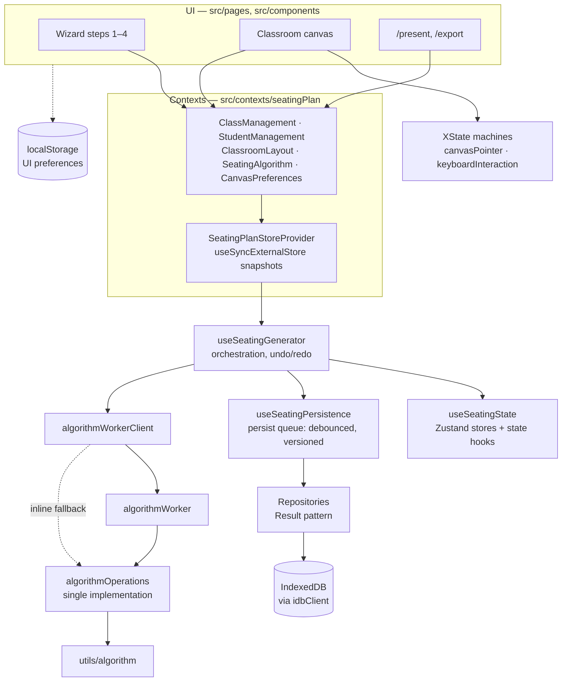
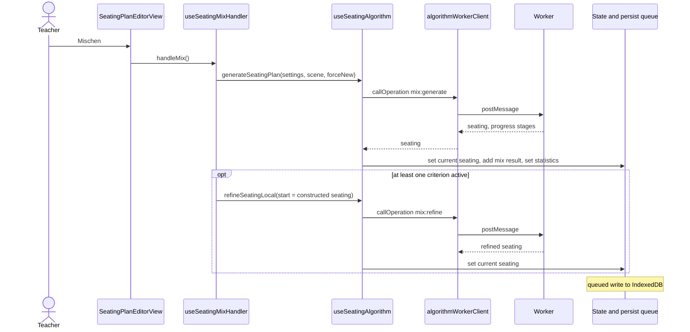
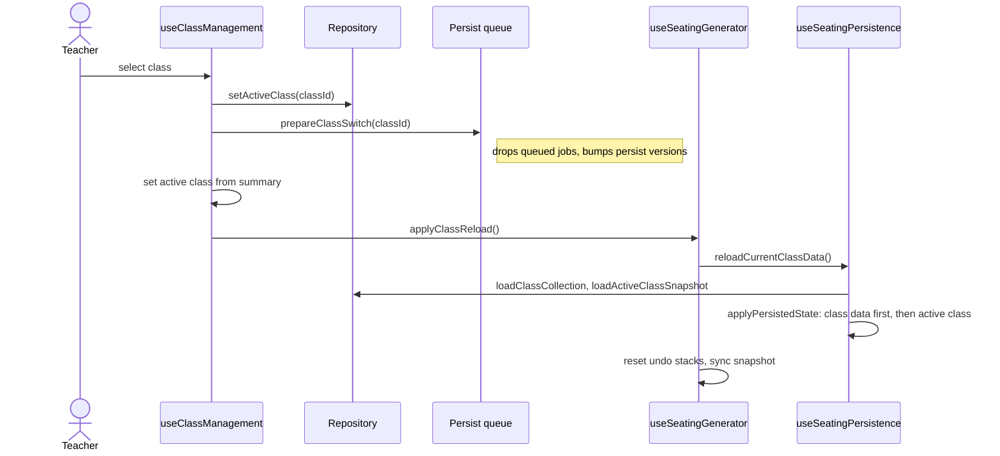

# Architecture

> **Status:** current · **Last reviewed:** 2026-09-14 · **Maintainer:** Eike
> Schäfer · **Describes:** Klassenplan 2.0.4

This is the entry point for anyone who wants to understand _why_ Klassenplan is
built the way it is. The documents linked at the end explain the individual
parts in depth; this one explains what they are for and how they fit together.

## Objective

Klassenplan helps teachers build, adjust and present seating plans from a class
list they already have — entirely in the browser, without an account, and
without student data ever leaving the device.

## Background

Teachers rebuild seating plans several times a year. Research puts the effect
of a seating arrangement on learning at a small d ≈ 0.1–0.2
([PEDAGOGY.md](PEDAGOGY.md)), so the value of a tool is not a mathematically
optimal plan. It lies in taking the preparation load off the teacher and in
structuring the reflection about how a class is composed. The algorithm's result
is a suggestion, never a decision.

The inputs are sensitive: names, optional photos and short descriptions of
current behaviour, mostly of minors. Depending on the reason behind it, a flag
such as `needsFrontSeat` can even touch Art. 9 GDPR. Klassenplan therefore runs
completely in the browser. The server only delivers static files; there is no
account, no server-side storage and no telemetry
([decision 0001](decisions/0001-offline-first-no-server.md)). Most of the
architecture follows from that one decision: the algorithm runs in a web worker,
data lives in IndexedDB, the app works offline as a PWA, moving between devices
happens through an encrypted backup file, and search engines get prerendered
HTML instead of a server-rendered page.

Klassenplan has been released since v1.0.0 (August 2025), works offline since
v1.2.0 and has been open source since v1.6.0 (June 2026);
[CHANGELOG.md](CHANGELOG.md) shows how it grew.

## Goals

1. **A usable plan in a few steps from the list the school already has.** Class
   lists exported from WebUntis, Schulmanager Online or SchILD-NRW import as
   they are; nobody has to retype a class.
2. **Student data stays on the teacher's device.** Nothing is transmitted,
   nothing is stored on a server.
3. **Teachers do not lose their work.** Changes are saved automatically, an
   encrypted backup moves everything to another device, and a reminder appears
   when the last backup is more than 30 days old.
4. **It works where lessons happen:** on the projector or whiteboard for a
   whole school day, on a tablet, on a laptop — and offline once loaded.
5. **The teacher stays in charge.** Seats can be locked and moved by hand, the
   weights are adjustable, statistics show which criteria a plan meets, and the
   pedagogical assumptions behind the defaults are written down.
6. **Everyone can use it:** keyboard only, with a screen reader, at 200 % zoom,
   in German or English.
7. **A school can run its own copy** from the published Docker image.

## Non-goals

- **No accounts, no sync, no sharing.** The only way data leaves a browser is
  a backup file the teacher exports.
- **No server-side storage, analytics, telemetry or remote logging.**
- **No classes above 36 students.**
- **No diagnoses.** Student attributes describe current behaviour in context;
  `needsFrontSeat` deliberately stores no reason.
- **No claim to the optimal plan** and no replacement for pedagogical judgement.
- **No free-form room geometry.** The room is a fixed 900 × 600 scene.
- **Phones are secondary.** The layout works there, but desktop, projector and
  tablet come first.
- **No English legal pages.** Impressum and Datenschutz are German only, as
  German law requires.

## Scenarios

**1. A new class at the start of the school year.** A teacher exports the class
list from WebUntis and drops the CSV into step 1. The import runs in its own
worker, detects the encoding and the WebUntis columns, and names the format it
found. In step 2 the teacher places tables from the toolbar and marks window,
door and board. In step 3 they set a few weights and press _Mischen_: the
arrangement is constructed and then refined in the algorithm worker, so the UI
stays responsive. They swap two students by hand, lock one seat and save the
plan under a name — which the plan usage record notes as a plan that is really
in use.

**2. On the projector for a whole school day.** The teacher opens `/present` on
the classroom PC in the morning and leaves the tab open. After 30 seconds the
plan counts as presented. If a new version is deployed during the day, the open
tab notices within the hour and _offers_ a reload; it never reloads on its own
in the middle of a lesson.

**3. A new term, new neighbours.** Months later the teacher shuffles again. The
"avoid previous pairs" criterion reads the plans that were really used —
presented, exported, saved — instead of the dozens of experiments from the
afternoon the first plan was made. A plan that was counted by mistake can be
withdrawn in the neighbourhood tab.

**4. Moving to another device.** The teacher exports an encrypted backup with a
password of at least eight characters, copies the file to the school laptop and
imports it there. The password is never stored; without it the file is
unreadable.

**5. A school hosts its own instance.** An IT administrator runs
`docker compose up -d` with `SITE_URL` set to the school's domain and puts a
TLS-terminating reverse proxy in front. The image already carries the security
headers.

**6. A shared computer in the staff room.** Data is stored unencrypted in the
browser profile, so anyone using the same profile can read it. This is a known
trade-off of having no server and no account ([SECURITY.md](SECURITY.md)); the
mitigation today is organisational — one browser profile per person.

## Constraints

| Constraint                | Value                                     | Why                                                                                                                                                                                |
| ------------------------- | ----------------------------------------- | ---------------------------------------------------------------------------------------------------------------------------------------------------------------------------------- |
| No server                 | static files only                         | Follows from goal 2. Consequences: no telemetry, prerendering for SEO, canonical URLs from the build-time `SITE_URL`, backups as files                                             |
| Students per class        | 36 (`MAX_STUDENTS`)                       | Documented both as algorithm cost ([AGENTS.md](../AGENTS.md)) and as a cap on imported data ([SECURITY.md](SECURITY.md)); the original reason is not recorded — see open questions |
| Room                      | 900 × 600 scene                           | Sized for up to 36 students (`constants.ts`); editor, export and presentation share one coordinate system                                                                          |
| Mix history               | 20 entries (`MIX_HISTORY_LIMIT`)          | Bounds memory and storage; also the window of recent shuffles the repetition criterion looks at                                                                                    |
| Backup files              | 16 MB encrypted, 12 MB decrypted          | Rejects corrupted or malicious files before parsing ([backup-format.md](backup-format.md))                                                                                         |
| Student photos            | 20 MB input, stored as ~160 px JPEG       | Keeps IndexedDB small and strips EXIF/GPS by re-encoding                                                                                                                           |
| Content Security Policy   | `script-src 'self'`, `connect-src 'self'` | No inline scripts, no third-party requests; speculation rules come as an HTTP header                                                                                               |
| Algorithm request timeout | 120 s by default                          | A stuck worker must fail visibly instead of silently re-running on the main thread                                                                                                 |

## How the parts fit together

### Layers

- **UI** components read trimmed state and actions from the domain contexts, not
  from the generator directly. `/present` and `/export` sit inside the same
  provider tree, so they show exactly what the wizard shows.
- **`useSeatingGenerator`** composes state, persistence, algorithm calls, class
  management and the plan usage record into one snapshot. The contexts slice
  that snapshot so a component only re-renders for what it uses.
- **Canvas interaction** (pointer and keyboard) is modelled as XState machines;
  domain data stays in the stores. See
  [canvas-interactions.md](canvas-interactions.md).
- **Persistence** is decoupled from rendering: state changes are queued per key
  (students, saved plans, mix history, current seating, locks, weights, room,
  circle layout, active plan), debounced and written through the repositories.
  Every repository call returns a `Result` ([ERROR-HANDLING.md](ERROR-HANDLING.md)).
- **The algorithm** runs in a web worker. `algorithmOperations.ts` is the only
  implementation, used by the worker and by the inline fallback alike, so both
  paths share their defaults. The fallback runs when workers are unavailable or
  a request fails; an aborted or timed-out request is rejected instead.

### Shuffling a plan

With every weight at 0 the handler uses neutral settings and skips the
refinement — the result is a purely random plan. _Verfeinern_ runs only the
second half. Details in [ALGORITHM.md](ALGORITHM.md).

### Switching classes

The order matters. The active class id is set optimistically, before the new
class's data has arrived, so anything that reads the id next to class data can
briefly see the new id beside the old class's plans. Two guards keep writes
from landing in the wrong class: the persist versions are bumped so stale jobs
are discarded, and `applyPersistedState` sets the class data before the class
id. Work that needs both together — such as the plan usage backfill — runs
inside `applyPersistedState`.

### Where data lives

| Data                                                                                              | Where                                                 | Notes                                                                          |
| ------------------------------------------------------------------------------------------------- | ----------------------------------------------------- | ------------------------------------------------------------------------------ |
| Classes: students, saved plans, mix history, current seating, locks, weights, room, circle layout | IndexedDB `spg.classCollection`, one record per class | Older single-class keys are migrated on first load                             |
| Room templates                                                                                    | IndexedDB `spg.classroomTemplates`                    |                                                                                |
| Plan usage record                                                                                 | IndexedDB `spg.planUsage`, one bucket per class       | Pair keys and timestamps only ([ALGORITHM.md](ALGORITHM.md#plan-usage-record)) |
| Student photos                                                                                    | Separate IndexedDB database `spg-student-photos`      | Blobs keyed by student id                                                      |
| Name game statistics                                                                              | IndexedDB `spg.nameGameStats`                         |                                                                                |
| UI preferences                                                                                    | localStorage                                          | No personal data                                                               |
| Backups                                                                                           | A file wherever the teacher saves it                  | AES-GCM encrypted ([backup-format.md](backup-format.md))                       |

All IndexedDB access goes through `src/repositories/idbClient.ts`. Live data is
not encrypted ([SECURITY.md](SECURITY.md)). Record shapes, versions, retention
and what "delete all data" removes are described in
[data-model.md](data-model.md).

### Build and delivery

- `npm run build:static` builds with Vite, renders every route in both
  languages in Chromium, verifies the output and checks the bundle budgets
  ([SEO.md](SEO.md), [PERFORMANCE.md](PERFORMANCE.md)).
- The Docker image builds on `node:24-bookworm-slim` and serves the result with
  nginx on `debian:trixie-slim`. Security headers come from
  `nginx-security-headers.conf`.
- A push to `main` runs CI only. A `v*` tag publishes the multi-arch image to
  GHCR and creates the GitHub release.
- The service worker precaches the app, so it works offline after the first
  visit. It uses the prompt update model: a new version waits until the teacher
  confirms the reload.

## Glossary

The UI speaks German, the code English. These are the terms that do not
translate one to one.

| UI (German)                               | Code                                                         | Meaning                                                                                    |
| ----------------------------------------- | ------------------------------------------------------------ | ------------------------------------------------------------------------------------------ |
| Klasse                                    | class, `activeClass`, `ClassCollectionState`                 | A group of up to 36 students with its own plans, room and weights                          |
| Klassenliste (step 1)                     | `students`, `Student`                                        | The students of the active class                                                           |
| Merkmal                                   | `restless`, `shy`, `concentrationIssues`, … on `Student`     | Contextual description of current behaviour, not a diagnosis                               |
| Klassenraum (step 2)                      | `ClassroomScene`, "scene"                                    | The 900 × 600 room: tables and room elements                                               |
| Einzelplatz, Doppelplatz, 4er-/6er-Gruppe | `TableTemplateType` (`single`, `double`, `group4`, `group6`) | Table types placed from the toolbar                                                        |
| Klassenraum-Vorlage                       | `ClassroomTemplate`                                          | A saved room layout — not to be confused with the table types above                        |
| Raumelement: Fenster, Tür, Tafel, Pult    | `ClassroomFeature` (`window`, `door`, `board`, `podium`)     | Fixed parts of the room that criteria can refer to                                         |
| Sitzplan (step 3)                         | `SeatingArrangement`, `currentSeating`                       | Tables × seats → student or empty                                                          |
| Mischen                                   | mix, shuffle, `mix:generate`                                 | Build a new arrangement (and refine it when criteria are active)                           |
| Verfeinern                                | refine, `refineSeatingLocal`, `mix:refine`                   | Improve the arrangement on screen by swapping students                                     |
| Kriterium, Gewichtung                     | `MixSettings`                                                | Weights 0–10 per criterion; defaults explained in [PEDAGOGY.md](PEDAGOGY.md)               |
| Gesperrter Platz                          | `lockedPositions`, `isSeatLocked`                            | A seat the algorithm must not change                                                       |
| Gespeicherter Plan                        | `SavedPlan` in `seatingHistory`                              | A plan saved under a name. Despite its name, `seatingHistory` holds saved plans, not a log |
| Mischung                                  | `MixResult` in `mixHistory`                                  | One shuffle result, kept for the last 20                                                   |
| Nachbarschaften                           | plan usage record, `PlanUsage`                               | Which plans were really used, and who sat next to whom                                     |
| Sitzkreis                                 | circle mode, `CircleLayout`, `seatingMode: 'circle'`         | Seating in a circle instead of tables                                                      |
| Präsentation                              | `/present`                                                   | Full-screen view for projector and whiteboard                                              |
| Namensspiel                               | `/namensspiel`                                               | Photo quiz and memory for learning students' names                                         |
| Backup                                    | `ExportBundle`, encrypted envelope                           | The one way data leaves the browser                                                        |

## Open questions

Each entry names the problem, the options and the next step. Decisions move to
a decision record once taken.

1. **Why 36 students?** The limit is explained as algorithm cost in one place
   and as an import cap in another. _Next step:_ measure generation and
   refinement time against class size with a seeded benchmark, then record the
   reason next to the constant.
2. **The mix history keeps the constructed arrangement, not the refined one.**
   With criteria active, _Mischen_ refines after the result was added to the
   history, so the repetition criterion sees the pairs from before refinement.
   Options: update the history entry after refinement, or keep it as it is.
   Either way it changes which pairs count as recent, so it needs a deliberate
   decision. _Next step:_ decide, then document it in
   [ALGORITHM.md](ALGORITHM.md).
3. **Some utils modules depend on layers above them.** Backup, migration, PDF
   export, state reset and the route preloader import repositories, hooks,
   stores, services or the page registry
   ([MODULE_BOUNDARIES.md](MODULE_BOUNDARIES.md#known-crossings-in-the-other-direction)).
   Options: move each module into `services/` or `repositories/`, or record it
   as intended. _Next step:_ decide file by file; the route preloader is
   already intended.
4. **The class switch relies on ordering.** Setting the class id and the class
   data in one transition would remove the hazard described above, but reaches
   deep into persistence. _Next step:_ weigh it as its own decision.
5. **Retention is bounded by count, not time.** Mix history and plan usage
   records are capped by number of entries; nothing expires at the end of a
   school year. _Next step:_ product decision.

## Resolved questions

**Module boundaries were written down but not enforced** (resolved
2026-09-14). [MODULE_BOUNDARIES.md](MODULE_BOUNDARIES.md) kept UI code out of
`@/utils/algorithm` and `@/utils/data`, yet 19 files in `components/` and
`pages/` imported from there, and the document named the wrong consumers for
the other layers. _Decision:_ dependency-free helpers (`shuffleArray`, the
storage keys) are surfaced through `@/utils`; the duplicate partner getters in
`utils/data/studentMigration.ts` were removed in favour of the identical ones
in `utils/student`; type imports and three pure display derivations stay
allowed because they must show exactly what the algorithm scores. ESLint
enforces the rest for `src/components` and `src/pages` and blocks component
imports in `src/utils`.

## Related documents

- [ALGORITHM.md](ALGORITHM.md) – construction, refinement, plan usage record
- [PEDAGOGY.md](PEDAGOGY.md) – assumptions behind criteria and default weights
- [MODULE_BOUNDARIES.md](MODULE_BOUNDARIES.md) – public utils API and import rules
- [ERROR-HANDLING.md](ERROR-HANDLING.md) – Result pattern, toasts, logging levels
- [LOGGING.md](LOGGING.md) – logger configuration
- [SECURITY.md](SECURITY.md) – CSP, headers, data at rest
- [decisions/](decisions/README.md) – recorded design decisions and their reasons
- [data-model.md](data-model.md) – stored keys, record shapes, versions, retention
- [backup-format.md](backup-format.md) – backup file format and encryption
- [csv-import.md](csv-import.md) – class list import format
- [worker-protocol.md](worker-protocol.md) – messages to and from the web workers
- [canvas-interactions.md](canvas-interactions.md) – pointer and keyboard state machines
- [SEO.md](SEO.md) – prerendering, canonical URLs, languages
- [PERFORMANCE.md](PERFORMANCE.md) – Web Vitals, bundle budgets
- [DESIGNSYSTEM.md](DESIGNSYSTEM.md) – design tokens
- [CHANGELOG.md](CHANGELOG.md) – release history
